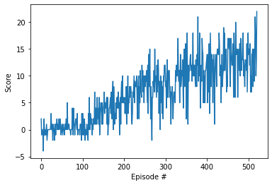

# Report: Solving the Navigation Environment

This report is meant to describe the implementation of the Navigation project.

## Learning algorithm
The chosen learning algorithm is a implementation of the plain vanilla Deep Q Network using batch replay and a target network.

As such, it uses two Neural Networks which represent the Q-table.
Both networks consist of two hidden layers with each 64 neurons using the ReLu activation function.

### How does it work?
The algorithm works as follows:

In the beginning, the agent is being initialized with the following values:
- `state_size`: the dimension of the state space; here, a state has 37 dimensions
- `action_size`: the dimension of the action space; here, the action space has 4 dimension since the agent can choose between 4 actions:
  - `0`: walk forward
  - `1`: walk backward
  - `2`: turn left
  - `3`: turn right
- `seed`: an arbitrary chosen number to act as seed for the used networks. This seed should help with the reproducibility of the results of the training. 

After the initialization, the agent can start to train episodically.

Each episode, the environment is firstly reset into its default `state`.
The agent then chooses an `action`:
Using the observed state, it calculates the values for each available action following the current policy.
Following the epsilon-greedy action selection, it then either chooses to take a random action and therefore explore the 
environment or to follow the policy.

The algorithm itself is being initialised with an start epsilon value of 1.0.  
Over the played episodes, this value decays with a factor of 0.995 until it reaches the minimum value set for epsilon (in this case 0.01).
This means, that the longer the agent trains, the less exploration it performs.

The chosen action is then being enacted in the environment.
After that, the agent receives the following state (`next_state`) as well as information about the immediate `reward` and if the episode is finished (=`done`).
Following the SARS-algorithm, the agent uses the information gathered so far to fill its replay memory.

Every 4 steps, the agent checks if the replay memory is full enough to perform some offline batch learning.
If the memory contains at least enough experience tuples to form a batch (in this case this would be 64 examples),
the agent samples from the memory and uses the sample to learn.

The learning itself is quiet straightforward. \
Using the target network, the agent predicts the Q values for all sampled `next_state`s and uses them to compute the target Q values (`Q_target`) for the current `state`s.
This calculation also uses the discount factor `gamma` which is set to 0.99 - meaning that the agent favors long term rewards over short term rewards.
Additionally, the agent also gets the expected Q values (`Q_expected`) from the policy network.\
With these two values (`Q_target` and `Q_expected`), it is now able to calculate the loss using the MSE function (Mean Squared Error)
and to use this loss to optimize the policy network.

Since the offline learning is only tacking place every 4 steps, the agent combines it with updating the weights in the target network 
(meaning the weights of the policy network are copied to the target network - this is usually done using an interpolation paramater `tau` in order to avoid a hard replace of the values).

This is repeated within and for each episode until the episode is finished.

For each episode, the collected reward is noted down and averaged over the last 100 episodes.
If the average reward/score is surpassing 13.0, the environment is considered solved so that the agent can stop learning.

## Plot of Rewards
The weights which can be found inside this repository have been trained for 521 episodes with the following scores achieved:

## Ideas for future work
Even though the agent learned rather quick (the provided benchmark implementations solved the project in only fewer than 1800 Episodes)
there is room for improvement.
Instead of relying on the vanilla DQN approach, one could implement one of the suggested improvements, such as e.g. Double Q Learning (DDQN),
Dueling DDQN, Prioritized DDQN or even the Rainbow algorithm.

Another suggestion for future work would also be to systematically tweak the used hyperparameters to find a set which allows the 
agent to solve the project faster without changing the underlying algorithm. 